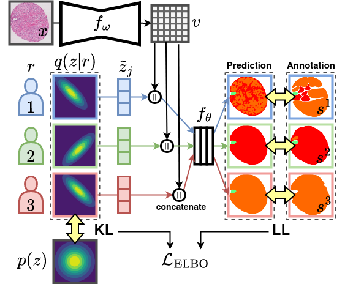

# Probabilistic Modeling of Inter- and Intra-observer Variability in Medical Image Segmentation
This is the code of the Pionono model for medical image segmentation (Probabilistic Inter-Observer and iNtra-Observer variation NetwOrk), presented at
ICCV 2023. 

Figure: The proposed Pionono model.
The labeling behaviour of each rater r is represented by a multivariate Gaussian distribution q(z|r). The drawn samples are concatenated with the extracted featuresand then fed into the segmentation head. 
The output simulates the inter- and intra-observer variability of annotations and is optimized using the real annotations of each rater. 
The model is trained end-to-end with a combination of log-likelihood loss (LL) and Kulback Leibler (KL) divergence between posterior and prior, combined in the overall loss.

## Dependencies/ Run Environment
* Use Miniconda/Anaconda to install all dependencies in an environment with `conda env create -f environment.yml`
* Activate the environment with `conda activate seg_crowd_env`
* For more information see www.anaconda.com
* All dependencies are also listed in the requirements.txt

## Run Code and Reproduce Experiments
* To run the model in the default configuration, simply use `python src/main.py`
* To reproduce the experiments of the articles, all configuration and run files are in the folders
  * dataset_dependent/gleason19/experiments
  * dataset_dependent/arvaniti_tma/experiments
* To reproduce all crossvalidation experiments of Gleason 2019, run `./dataset_dependent/gleason19/experiments/cross_validation/run.sh`
* To reproduce all experiments of external testing, run `dataset_dependent/gleason19/experiments/external_testing/run.sh`
* To reproduce all crossvalidation experiments of Arvaniti TMA, run `dataset_dependent/gleason19/experiments/external_testing/run.sh`

## Configuration
* For experiments there are three levels of configurations:
    1. The default config
    2. The dataset config
    3. The experiment config
* The configuration will be loaded in this order and parameters will be overwritten
* How to define config paths:
    1. The default config: `-c [path/to/config.yaml]`
    2. The dataset config: `-dc [path/to/dataset_config.yaml]`
    3. The experiment config: By changing the experiment folder `-ef [path/to/directory]`. Here a file `exp_config.yaml` is expected.
* Example: `python src/main.py -c ./dataset_dependent/gleason19/experiments/cross_validation/pionono/base_config.yaml -dc ./dataset_dependent/gleason19/data_configs/data_config_crossval0.yaml -ef ./dataset_dependent/gleason19/experiments/cross_validation/pionono/cval0
`

## Pretrained models
* Pretrained models are available upon request
* They can be loaded with this code by using the config (model:  load_model: /path/to/model.pth)

## Logging with mlflow
* All experiments are logged with mlflow
* For the python library of mlflow checkout https://www.mlflow.org/docs/latest/python_api/mlflow.html#module-mlflow 
* The mlflow logging path is defined in the config (logging:  mlruns_folder: /path/to/mlruns).

